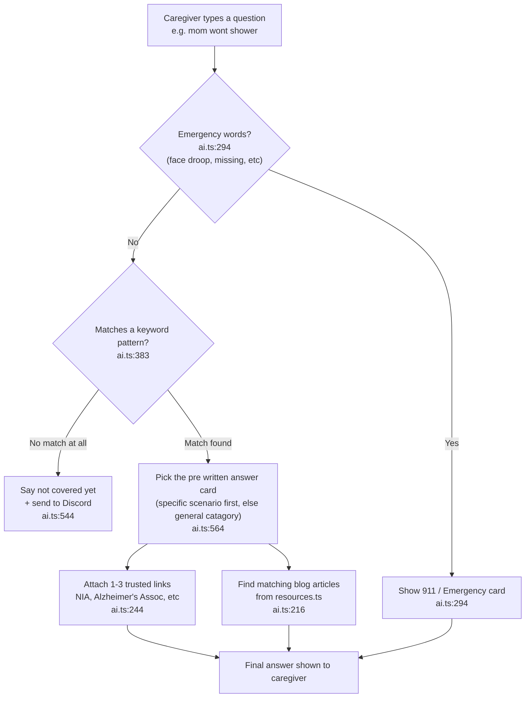

# DementiaAide Assistant (MVP)

Easy to undertstand Guide on how the chatbot works for Ana!

# Picture of How It Works



# Explanation of Ai.ts

Step 1:
ai.ts:383 is how the "chatbot" filters for the correct catagory, it scans for keywords like shower bath etc using a big list of patterns. If it cant match any catagory it falls through to "general" (see Step 5).

Note: ai.ts:126 is NOT part of this step, even though it looks related. That's a separate synonym list (shower = bath = hygiene, etc) thats only used later in Step 4 to help find matching blog articles, not to pick the catagory.

Step 2:
ai.ts:294 is how we check for red flags where we instantly tell users to call 911, we look for words like missing person, face droop etc.

Step 3:
ai.ts:564 is where we have pre written information/explaination that we give the user based on the catagory chosen from step 1. It actually picks the most specific match first (like "bathing_resistance"), and only uses the more general catagory answer if theres no specific one written for that situation.

Step 4: 
ai.ts:40 is just the list of trusted reading links (NIA, Alzhiemers's Association, etc) sitting in the file. ai.ts:244 is what actually picks which 3 links to attach to the answer, and ai.ts:1162 is where that gets called. 

Step 5:
If nothing matches then we say that we dont have this covered then we send them to the Discord. ai.ts:544

# Explaination of resources.ts

This file is basically a spreadsheet of all of Ana's blog articles, written directly into the code. ai.ts uses this list to recommend articles that go along with an answer. (I think we would move this to a database in the future)

Step 1:
resources.ts:25 is the "shape" every article card has to follow: a title, a slug (the web-address version of the title), a catagory, a one sentence summary, some tags (keywords), and a yes/no for featured.

Step 2:
resources.ts:79 is the actual list, about 48 cards, one per real blog post, each filled out by hand using that shape from Step 1.

Step 3:
resources.ts:16 is the list of the 7 catagory buckets an article can be filed under (Start Here, Daily Care, Safety & Crisis, etc), and resources.ts:34 has a short description and icon/color for each bucket, used to make the resources page look nice.

Step 4:
When ai.ts wants to recommend articles for a question, it checks the title/summary/catagory/tags of every card here against the persons question and the keywords from Step 1 of the ai.ts section, then picks the best matching cards (see ai.ts:216).

Step 5:
resources.ts:450 (getResourceUrl) is what turns a cards slug into the actual clickable link to Ana's blog.

# How To Add Your Own Stuff (for Ana)

Note: line numbers move around as the file grows, so these just show you the format/shape to copy. Look for the word in **bold** to find where it lives in the file now.

### Adding a new blog article (resources.ts)

Find the **resources** list and paste a new card in, following the same shape as the others:

```ts
{
  title: 'Your Article Title Here',
  slug: 'your-article-title-here', // has to match the actual URL on the blog
  category: 'Daily Care', // pick one of the 7 catagories from resourceCategoryMeta
  summary: 'One sentence describing what the article covers.',
  tags: ['keyword1', 'keyword2', 'keyword3'], // words caregivers might type
  featured: true, // optional, only add this line if you want it highlighted
},
```

### Adding a new pre written answer (ai.ts)

This takes 2 steps, they both have to be done together or the new answer will never get picked.

1. Find **detectCategoryAndScenario** and add a new "if" so it recognizes the topic:
```ts
if (lowerQuery.match(/keyword1|keyword2|another phrase/)) {
  return { category: 'daily', scenario: 'your_new_scenario_name' };
}
```

2. Find **scenarioResponses** and add a matching card using that same scenario name:
```ts
your_new_scenario_name: {
  category: 'Daily Care',
  explanation: 'A paragraph explaining why this happens and how to think about it.',
  tips: [
    'First practical tip',
    'Second practical tip',
    'Add as many as feel useful, existing cards have around 10'
  ]
},
```

### Adding a new trusted source link (ai.ts)

Find **trustedCareSources** and add a new entry:
```ts
yourSourceKey: {
  title: 'Name of the Article/Page',
  publisher: 'Organization Name',
  summary: 'One sentence about what it covers.',
  url: 'https://...',
},
```
Then, to actually attach it to answers, find **sourceKeysByScenario** or **sourceKeysByCategory** and add `'yourSourceKey'` into the list for the topics it fits.

### Adding a new emergency / 911 trigger (ai.ts)

Find **detectUrgentNotice** and add a new "if" block following the same shape as the existing ones (title, message, actions), with a regex of the phrases that should trigger it.


